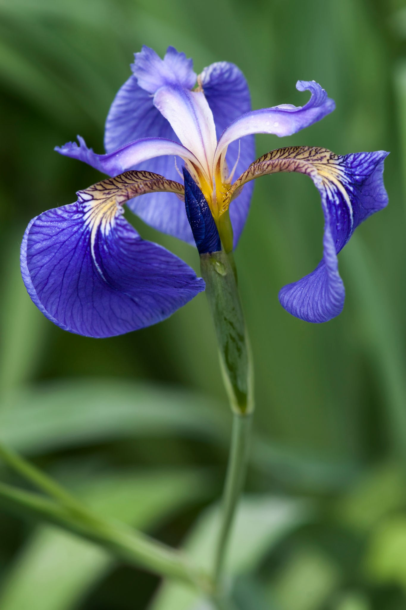
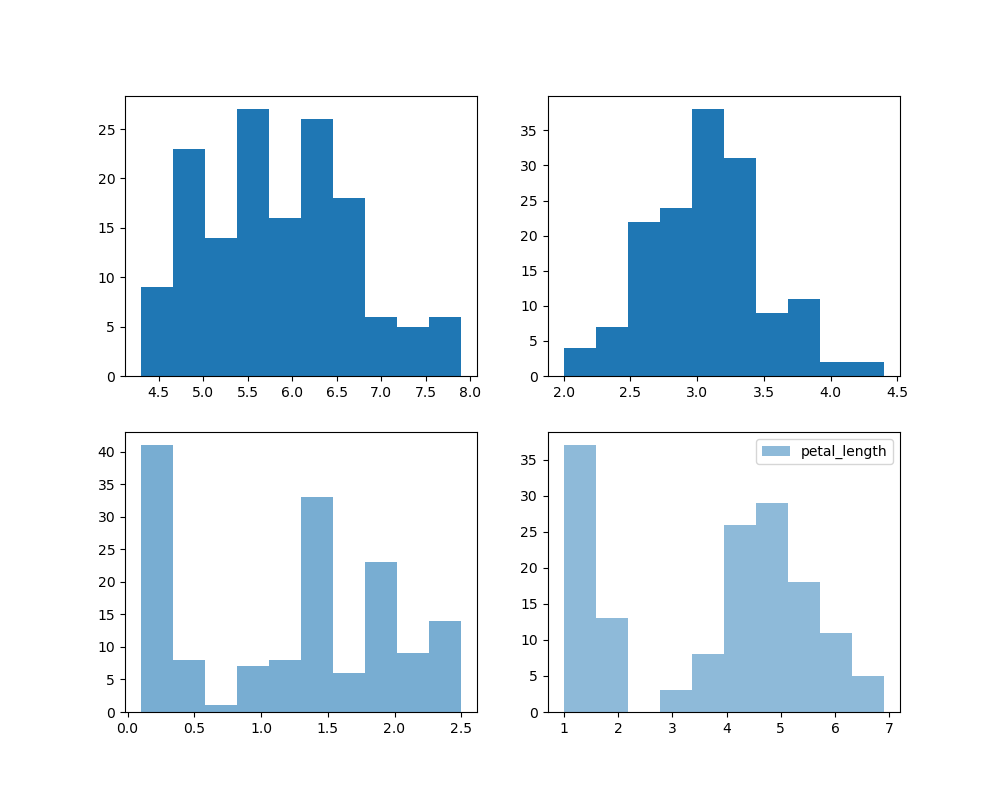
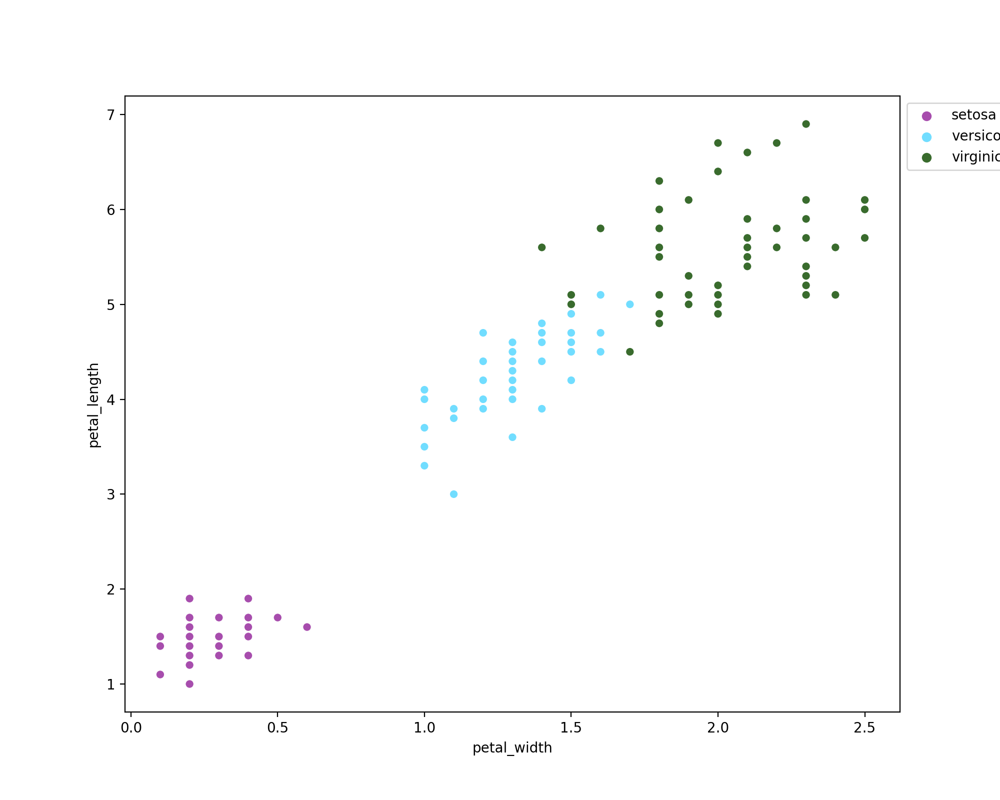
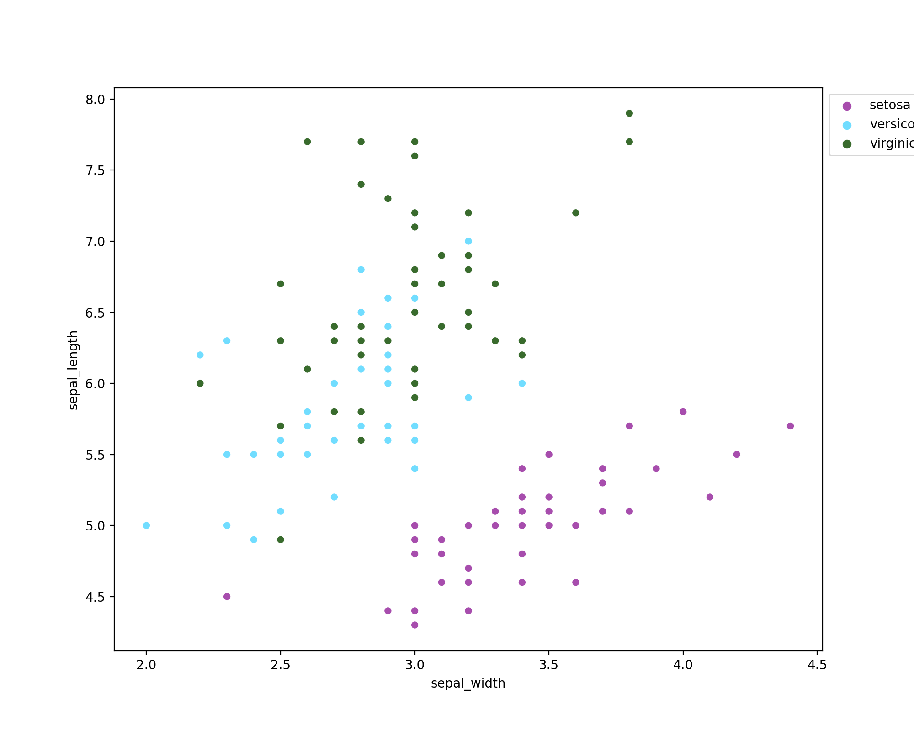
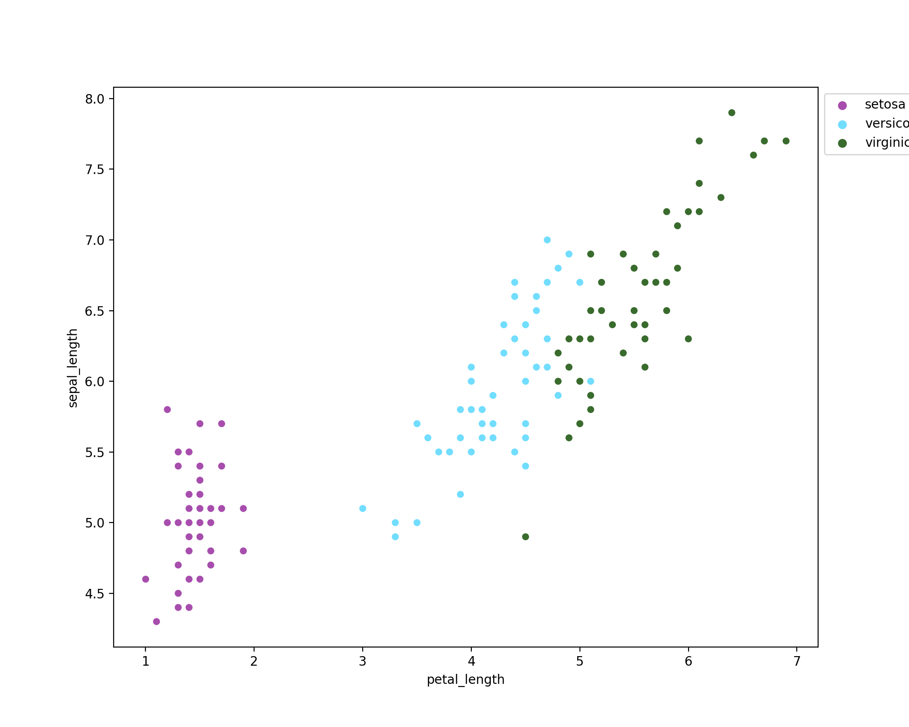
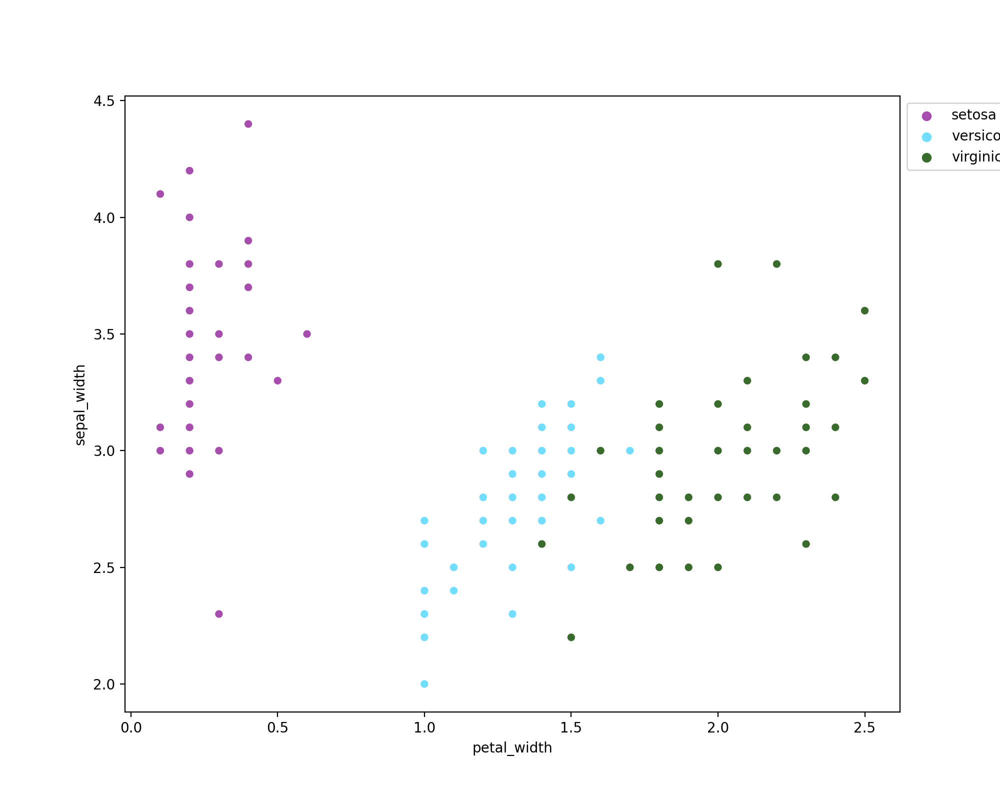
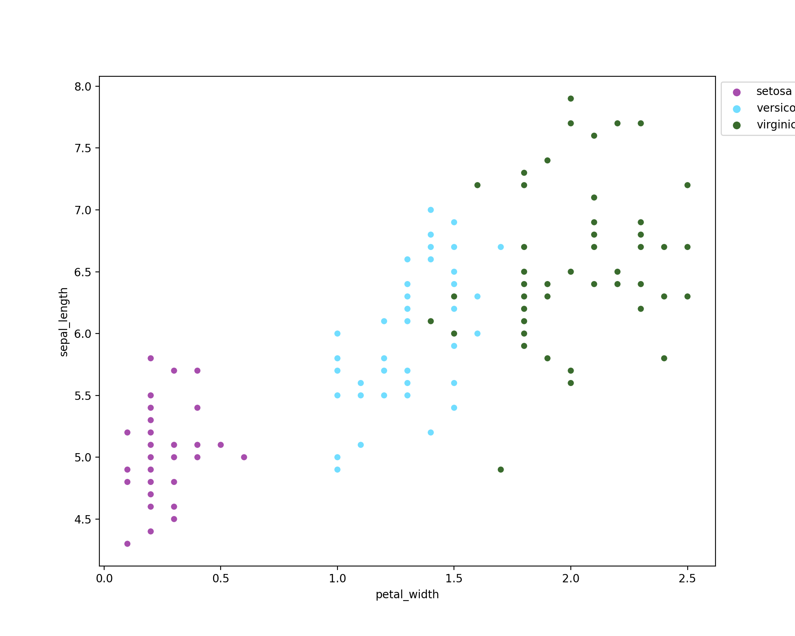
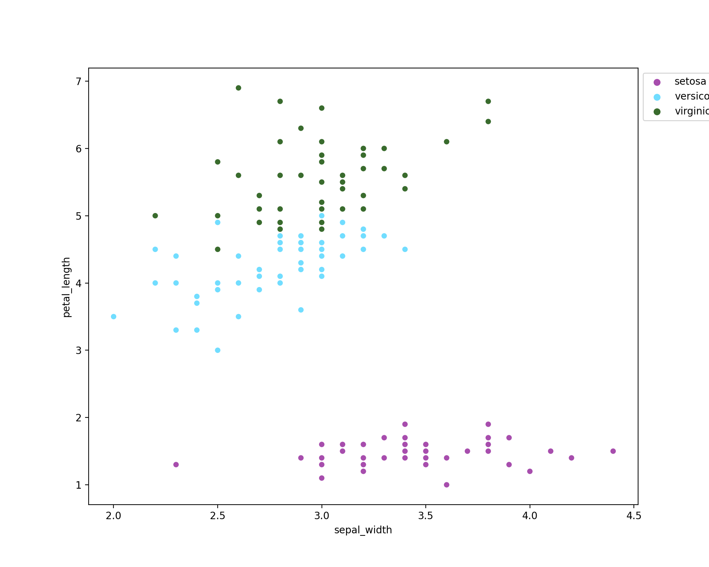

# pands-project

## Final Project for PANDS Module - HDIP in Data Analytics 2023

| Info | Details |
| -------- | -------- |
| Course: | KDATG_L08_Y1 |
| Author: | Rebecca Hannah Quinn |
| Student Number: | G00425671 |

---

### Investigating Fisher's Iris Data Set

The Iris Data Project is a well-known dataset in the machine learning community. It contains 150 samples of iris flowers, where each sample has four features/attributes: sepal length, sepal width, petal length, and petal width. The samples are equally distributed among three different species: setosa, versicolor, and virginica. This dataset is often used for classification tasks in machine learning and those learn data analytics.[^1]

For this project we are to creates various graphs from the data set downloaded so we can better understand the data within.

---

### Iris Varieties

|Setosa|Versicolor|Virginica|
|-------|------|------|
||||

---

### Part 1: Reading In The Data

To start we use some methods to read the data and make sense of what is there in order to be able to code the histogram and scatterplots that follow.

```python
df = pd.read_csv("iris.csv")
print(df.head())
print(df.shape())
```
Results of head() method[^2]:
|   |sepal_length | sepal_width | petal_length | petal_width | species |
|------|------------|-------------|------------|---------------|---------|
|0     |      5.1     |     3.5     |      1.4      |    0.2  |setosa|
|1     |     4.9      |    3.0      |     1.4       |   0.2  |setosa|
|2     |   4.7       |    3.2      |     1.3       |   0.2  |setosa|
|3     |   4.6       |   3.1      |     1.5      |    0.2  |setosa|
|4     |  5.0        |  3.6        |   1.4        |  0.2  |setosa|
|*this shows us the first 5 rows of data and their column titles which come in useful later to source data required*|

The results of the shape() method shows us that there are 5 columns and 150 rows of data in a simple result: (150, 5) (Rows, Columns)[^3]

Value_counts() used with "species" returns the count of each species in the date. In this case the result is even with 50 rows for each making up the 150 total:

|species|data values|
|----|-------|
|setosa    |    50|
|versicolor |   50|
|virginica   |  50|
|Name: species, dtype: int64|
|<class 'pandas.core.frame.DataFrame'>|

Finally, we check that there are no null values in the data and this results in: [^4]
|  attribute  |  isnull count  |
|-------------|----|
|sepal_length |   0|
|sepal_width  |   0|
|petal_length |   0|
|petal_width  |   0|
|species      |   0|
|dtype: int64 | *datatype*|
[^5]

---

### Part 2: Reading And Writing Data

[^6]

In the second part of this we look at how to read and write data using our initial file read in and the to write a second file to save the summer of the describe() method.[^7] [^8]

In order to write a new file which contains a summary of the data we must first create a variable and method describe:

```python
summarize = df.describe()
```

This results shows us the count of each column with also the mean value, standard deviation and min and max values in the summary as follows. The 25%, 50% and 75% shows how much of your data is has the corrosponding value or less:

|   ID   |    0      |     1     |      3      |     2     |
|------|-----------|-----------|-------------|-----------|
|count |150.000000 | 150.000000 | 150.000000        | 150.000000|
|mean  |   5.843333 |   3.054000    |3.758667       | 1.198667|
|std   |   0.828066  |  0.433594    |1.764420       | 0.763161|
|min   |   4.300000   | 2.000000    |1.000000       | 0.100000|
|25%   |   5.100000   | 2.800000    |1.600000       | 0.300000|
|50%    |  5.800000   | 3.000000    |4.350000       | 1.300000|
|75%     | 6.400000   | 3.300000   | 5.100000       | 1.800000|
|max      |7.900000   | 4.400000  |  6.900000       | 2.500000|

Once this prints correctly we can continue and open and write a new file with these contents at the same time (see Fig: summary.txt). We call the variable "summarize" in order to read the file to get the information that will be written into the new file using write() method and to_string() [^9] [^10] [^11]

```python
with open ("summary.txt", "w+") as file:
    file.write(summarize.to_string())
file.close()
```

[^12]

---

### Part 3: Histograms, Scatterplots, Etc

For this project we are to do the following:

1. Output a summary of each variable to a single text file.
2. Saves a histogram of each variable to png files.
3. Outputs a scatter plot of each pair of variables.
4. Performs any other analysis you think is appropriate.

We have already output the summary for us to understand the values and their distributions etc and now we will create visual representations of the data to better understand the differences and comparisons of the 3 species of iris and their 4 attributes/values.

---

#### Histograms

For the historgram section of this project it took me awhile to wrap my head around using the data I can grab from the dataframe and putting into a visual.
In the end I found the best way to do it was to make a histogram of all 4 attributes to compare their distributions

```python
cols = ["sepal_length", "sepal_width", "petal_width", "petal_length"]
df.rename(columns = {cols[0]:0, cols[1]:1, cols[2]:2, cols[3]:3}, inplace=True)
df.loc[::50]
```

Renaming column labels using a dictionary to use later when needed for naming in the histogram, and loc() property which works like the head() method to return the specified amount of rows and columns from the dataset. Here we request all columns and every 50th row (the first row of each species) [^13] I thought it was best to stick with histograms to start as box plots did not make too much sense to me in regards to using them and felt not many would either.

The following histograms show that the four attributes are either evenly distributed (bell shaped or not), sepal length and width are evenly distributed so have an even or normal distribution but petal length and width do not. [^14]

```python
fig, ax = plt.subplots(2, 2, figsize = (10, 8))

ax[0, 0].set_title("Sepal Length")
ax[0, 0].hist(df[0], label=cols[0], color="#F7EE77", ec="#DED66A")
ax[0, 1].set_title("Sepal Width")
ax[0, 1].hist(df[1], alpha=1, label=cols[1], color="#511FC2", ec="#1B0B42")
ax[1, 0].set_title("Petal Width")
ax[1, 0].hist(df[2], alpha=0.6, label=cols[2], color="#F78E77", ec="#B86A58")
ax[1, 1].set_title("Petal Width")
ax[1, 1].hist(df[3], alpha=0.5, label=cols[3], color="#41AB85", ec="#296B53")

plt.legend()
plt.savefig("Histograms")
```



[^14] [^15] [^16] [^17]

---

#### Scatterplots

Scatterplots allow us to see clearly the relation between length and width of each attribute while seeing where each species particular attribute lies. To do this Seaborn and Matplotlib were used together. Seaborn was used as I thought it was better to customize the scatterplots.

##### Petal Length v Petal Width

```python
plt.gcf().set_size_inches(10, 8)
```

gcf() is to set the size of the image the scatter plot will fit into. Following this, the scatterplot is plotted with x, y, hue, data and palette. Data points back to the code reading the file and x, y, and hue call the information from there. Paletter customises the colors, the first points to "setosa", second to "versicolor" and third "virginica" and then legend() notes which color is which with a label and location of legend is set.

```python
sns.scatterplot(x="petal_width", y="petal_length", hue="species", data=df, palette=["#A74DAD", "#71DDFF", "#396B2D"])
plt.legend(bbox_to_anchor=(1, 1), loc=2)
```

The following code completes each scatter plot, it includes the code to save the information in an image and closes the file so the data doesnt end up on on graph altogether.

```python
plt.savefig("Petal Width V Petal Length Scatterplot", dpi=200)
plt.close()
```

---

|Histograms |           |
|-----------|-----------|
|||
|||
|||

With these scatterplots we can see a few different things.

1. Setosa are quite small in petal length and width in comparison to Versicolor which would be the second biggest in both attributes, leaving Virginica to have the biggest petals of the Iris varieties flowers.
2. Setosa sepal widths are largest in comparison to their length and the other two varieties, which mix together in this comparison of sepal width versus sepal length. Sepal length and petal length on setosa are smallest by minimum of about 1cm.
3. Petal Width and Sepal Width seem to correlate with each species and the longer the sepal length the longer the peals length as well.
4. If the sepal is longer is its more than likely slimmer but both versicolor and virginica are quite scattered and mixed on this graph with two or three species samples being wider than usual.

---

---

### References

[^1]: https://gist.github.com/curran/a08a1080b88344b0c8a7
[^2]: https://www.w3schools.com/python/pandas/ref_df_head.asp#:~:text=Definition%20and%20Usage,a%20number%20is%20not%20specified.&text=Note%3A%20The%20column%20names%20will,addition%20to%20the%20specified%20rows.
[^3]: https://www.digitalocean.com/community/tutorials/python-shape-method#
[^4]: https://www.geeksforgeeks.org/working-with-missing-data-in-pandas/
[^5]:https://www.geeksforgeeks.org/python-basics-of-pandas-using-iris-dataset/
[^6]: https://www.geeksforgeeks.org/exploratory-data-analysis-on-iris-dataset/
[^7]: https://www.statology.org/pandas-describe-only-mean-std/
[^8]: https://www.askpython.com/python/examples/calculate-summary-statistics#
[^9]: https://www.freecodecamp.org/news/file-handling-in-python/
https://www.pythontutorial.net/python-basics/python-write-text-file/
[^10]: https://pandas.pydata.org/docs/reference/api/pandas.DataFrame.to_string.html
[^11]: https://www.youtube.com/watch?v=vmEHCJofslg&t=1068s
[^12]: https://www.markdownguide.org/cheat-sheet/
[^13]: https://www.youtube.com/watch?v=02BFXhPQWHQ
[^14]:https://www.statology.org/normality-test-python/
https://www.geeksforgeeks.org/exploratory-data-analysis-on-iris-dataset/
https://matplotlib.org/stable/gallery/statistics/hist.html
https://pandas.pydata.org/docs/reference/api/pandas.DataFrame.hist.html
https://www.statology.org/matplotlib-histogram-color/
https://cmdlinetips.com/2019/04/how-to-specify-colors-to-scatter-plots-in-python/
https://stackoverflow.com/questions/13073045/matplotlib-savefig-size-control
https://stackoverflow.com/questions/36018681/stop-seaborn-plotting-multiple-figures-on-top-of-one-another


