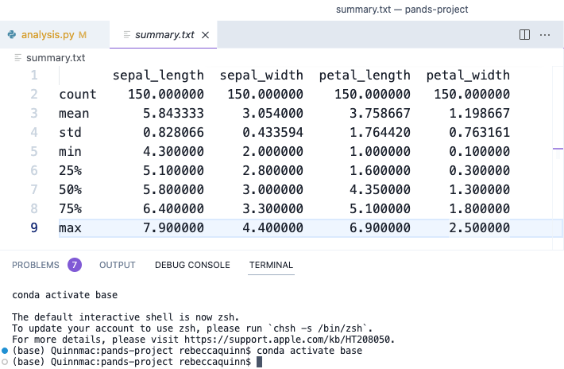

# pands-project

## Final Project for PANDS Module - HDIP in Data Analytics 2023

| Info | Details |
| -------- | -------- |
| Course: | KDATG_L08_Y1 |
| Author: | Rebecca Hannah Quinn |
| Student Number: | G00425671 |

---

### Investigating Fisher's Iris Data Set

The Iris Data Project is a well-known dataset in the machine learning community. It contains 150 samples of iris flowers, where each sample has four features/attributes: sepal length, sepal width, petal length, and petal width. The samples are equally distributed among three different species: setosa, versicolor, and virginica. This dataset is often used for classification tasks in machine learning and those learn data analytics.[^1]

For this project we are to creates various graphs from the data set downloaded so we can better understand the data within.

---

### Part 1: Reading In The Data

To start we use some methods to read the data and make sense of what is there in order to be able to code the histogram and scatterplots that follow.

```python
df = pd.read_csv("iris.csv")
print(df.head())
print(df.shape())
```
Results of head() method[^2]:
|   |sepal_length | sepal_width | petal_length | petal_width | species |
|------|------------|-------------|------------|---------------|---------|
|0     |      5.1     |     3.5     |      1.4      |    0.2  |setosa|
|1     |     4.9      |    3.0      |     1.4       |   0.2  |setosa|
|2     |   4.7       |    3.2      |     1.3       |   0.2  |setosa|
|3     |   4.6       |   3.1      |     1.5      |    0.2  |setosa|
|4     |  5.0        |  3.6        |   1.4        |  0.2  |setosa|
|*this shows us the first 5 rows of data and their column titles which come in useful later to source data required*|

The results of the shape() method shows us that there are 5 columns and 150 rows of data in a simple result: (150, 5) (Rows, Columns)[^3]

Value_counts() used with "species" returns the count of each species in the date. In this case the result is even with 50 rows for each making up the 150 total:

|species|data values|
|----|-------|
|setosa    |    50|
|versicolor |   50|
|virginica   |  50|
|Name: species, dtype: int64|
|<class 'pandas.core.frame.DataFrame'>|

Finally, we check that there are no null values in the data and this results in: [^4]
|  attribute  |  isnull count  |
|-------------|----|
|sepal_length |   0|
|sepal_width  |   0|
|petal_length |   0|
|petal_width  |   0|
|species      |   0|
|dtype: int64 | *datatype*|
[^5]

---

### Part 2: Reading And Writing Data

[^6]

In the second part of this we look at how to read and write data using our initial file read in and the to write a second file to save the summer of the describe() method.[^7] [^8]

In order to write a new file which contains a summary of the data we must first create a variable and method describe:

```python
summarize = df.describe()
```

This results shows us the count of each column with also the mean value, standard deviation and min and max values in the summary as follows. The 25%, 50% and 75% shows how much of your data is has the corrosponding value or less:

|   ID   |    0      |     1     |      3      |     2     |
|------|-----------|-----------|-------------|-----------|
|count |150.000000 | 150.000000 | 150.000000        | 150.000000|
|mean  |   5.843333 |   3.054000    |3.758667       | 1.198667|
|std   |   0.828066  |  0.433594    |1.764420       | 0.763161|
|min   |   4.300000   | 2.000000    |1.000000       | 0.100000|
|25%   |   5.100000   | 2.800000    |1.600000       | 0.300000|
|50%    |  5.800000   | 3.000000    |4.350000       | 1.300000|
|75%     | 6.400000   | 3.300000   | 5.100000       | 1.800000|
|max      |7.900000   | 4.400000  |  6.900000       | 2.500000|

Once this prints correctly we can continue and open and write a new file with these contents at the same time (see Fig: summary.txt). We call the variable "summarize" in order to read the file to get the information that will be written into the new file using write() method and to_string() [^9] [^10] [^11]

```python
with open ("summary.txt", "w+") as file:
    file.write(summarize.to_string())
file.close()
```

[^12]

---

### References

[^1]: https://gist.github.com/curran/a08a1080b88344b0c8a7
[^2]: https://www.w3schools.com/python/pandas/ref_df_head.asp#:~:text=Definition%20and%20Usage,a%20number%20is%20not%20specified.&text=Note%3A%20The%20column%20names%20will,addition%20to%20the%20specified%20rows.
[^3]: https://www.digitalocean.com/community/tutorials/python-shape-method#
[^4]: https://www.geeksforgeeks.org/working-with-missing-data-in-pandas/
[^5]:https://www.geeksforgeeks.org/python-basics-of-pandas-using-iris-dataset/
[^6]: https://www.geeksforgeeks.org/exploratory-data-analysis-on-iris-dataset/
[^7]: https://www.statology.org/pandas-describe-only-mean-std/
[^8]: https://www.askpython.com/python/examples/calculate-summary-statistics#
[^9]: https://www.freecodecamp.org/news/file-handling-in-python/
[^10]: https://pandas.pydata.org/docs/reference/api/pandas.DataFrame.to_string.html
[^11]: https://www.youtube.com/watch?v=vmEHCJofslg&t=1068s
[^12]: https://www.markdownguide.org/cheat-sheet/
